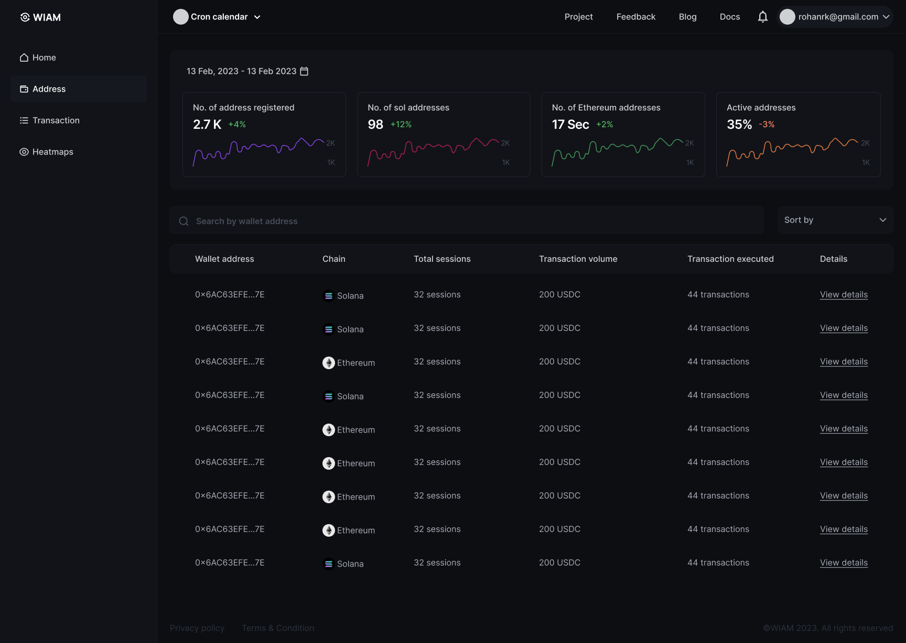
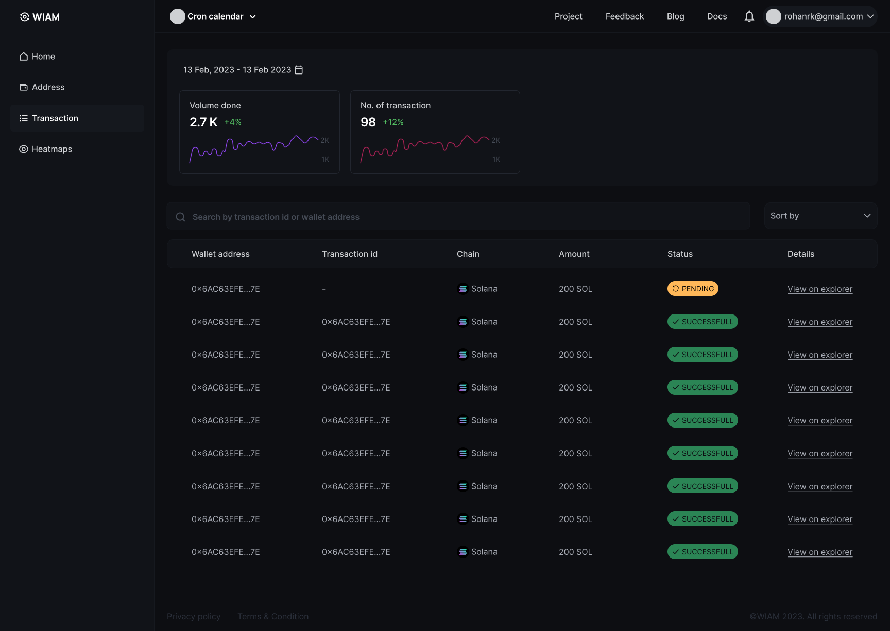

### WIAM is a analytics tool targetted towards solana projects.

- State Management with [Jotai](https://jotai.org/).
- Tabled using [Tanstack Table](https://tanstack.com/table/v8).
- [Tanstack Query](https://tanstack.com/query/latest) for making async queries.
- [Tailwind](https://tailwindcss.com) for styling.
- [Recharts](https://recharts.org) for building charts.
- Solana Wallet Adapter - to help connect with solana based wallets
- [wiam-sdk](https://github.com/sk1122/wiam-sdk)

# Features
---
> CHARTS

> ADDRESS TABLE

> TRANSACTION TABLE

